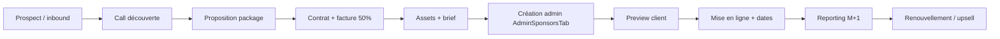

# Plan sponsoring payant — Soundy

*Document commercial & produit · getsoundy.com · Juin 2026*

> Ce plan s’appuie sur l’**infrastructure sponsors déjà en production** (admin, API, 4 emplacements natifs) et sur le modèle économique Soundy (abonnements, pourboires, B2B lieux). Les tarifs sont calibrés pour le **marché France — musique, nightlife, indie** — avec une montée en charge progressive par ville.

---

## 1. Résumé exécutif

Soundy dispose aujourd’hui d’un **réseau publicitaire natif intégré** à l’expérience musicale : carte géolocalisée, fil d’actualité, stories et reels. La monétisation sponsor est la **priorité court terme** du modèle économique (45–55 % du revenu cible à M24, selon le pitch deck).

**Proposition de valeur annonceur :**

- Audience **qualifiée musique & sorties** (fans, DJs, bars, labels), pas un feed généraliste.
- **Contexte géolocalisé** : salons, lives et événements autour de l’utilisateur (rayon carte ~10 km, événements « autour de 30 km »).
- Formats **non intrusifs** : bandeaux natifs, carrousel, reels sponsorisés plein écran — pas de pop-up interstitiel agressif.
- **Transparence** : badge « Sponsorisé » vs « Promo » (Soundy interne), durée d’affichage configurable, créneaux horaires via dates de campagne.

**Objectif M12 :** 40 k€ ARR sponsors · 5–8 contrats récurrents · 2 sponsors fondateurs en phase pilote.

---

## 2. Infrastructure existante (état produit)

### 2.1 Emplacements opérationnels

| Emplacement code | Surface UI | Format | Spec visuelle | Statut |
|------------------|------------|--------|---------------|--------|
| `map_banner` | Onglet **Carte** — carrousel bandeau | Logo + titre + sous-titre + CTA | Logo 80×80 px · bandeau 360×90 px (mobile) | **Live** |
| `feed_inline` | Onglet **Actualités** — entre les posts | Carte inline native | Logo 48×48 px · bannière 343×120 px | **Live** |
| `stories_banner` | Bandeau au-dessus des **Stories** | Bandeau fin | Logo 32×32 px · 390×56 px | **Live** |
| `reels_sponsored` | Onglet **Reels** — slide plein écran | Vidéo 9:16 ou vignette + CTA | 1080×1920 px · logo 64×64 px | **Live** |

### 2.2 Paramètres techniques (déjà codés)

| Paramètre | Valeur | Usage |
|-----------|--------|-------|
| `displayDurationSec` | 3–60 s (défaut **8 s**) | Durée d’affichage avant rotation carrousel (carte, feed, stories) |
| `reelsSponsorEveryN` | 1–50 (défaut **5**) | 1 reel sponsorisé tous les N reels organiques |
| `reelsSponsorEnabled` | on/off | Activation globale des reels sponsorisés |
| `priority` + réordonnancement | entier | Ordre de rotation dans un emplacement |
| `startsAt` / `endsAt` | timestamps | Planification campagne |
| `kind` | `promo` \| `sponsored` | Promo Soundy vs annonce payante (badge UI) |
| `actionId` | `salon` \| `live` | CTA interne (pas de lien externe) — réservé promos plateforme |

**API publique :** `GET /api/sponsors/map|feed|stories|reels` · **Admin :** CRUD complet via `AdminSponsorsTab`.

### 2.3 Emplacements roadmap (non facturables MVP)

| Emplacement | Description | Phase |
|-------------|-------------|-------|
| **Salon sponsorisé** | Mise en avant d’un salon Spotify/YouTube (ancrage carte) | M4–M6 |
| **Live overlay sponsor** | Bandeau discret pendant un direct (logo + CTA) | M6–M9 |
| **Événement carte premium** | Pin / fiche événement sponsorisée (30 km) | M4–M6 |
| **Takeover ville** | Dominance temporaire sur tous les emplacements d’une zone | M9+ |

---

## 3. Cibles annonceurs

### 3.1 Segments prioritaires

| Segment | Exemples | Besoin | Emplacement privilégié |
|---------|----------|--------|------------------------|
| **Lieux & nightlife** | Bars, clubs, salles 50–500 places | Remplir les soirs, promo soirée | Carte + feed + événement 30 km |
| **Festivals & billetterie** | Shotgun, Dice, billetteries locales | Ventes early bird, line-up | Reels + feed + takeover |
| **Labels & distributeurs** | Labels indie, maisons de disques | Sortie album, clip, tournée | Reels + stories |
| **Marques lifestyle** | Boissons, mode street, tech audio | Notoriété 16–35 ans | Reels + stories |
| **Streaming & retail musique** | Deezer, Fnac, disquaires | Acquisition, offres | Carte + feed |
| **Équipement & créateurs** | Casques, interfaces, DAW | Ciblage DJs / producteurs | Live overlay + reels |

### 3.2 Personas acheteur

| Persona | Rôle | Budget typique | Mode d’achat |
|---------|------|----------------|--------------|
| **Sophie** — gérante de bar | Propriétaire / marketing local | 300–1 500 €/mois | Managed (account Soundy) |
| **Marc** — label indie | Responsable promo | 800–3 000 €/campagne | Managed ou self-serve Pro |
| **Agence media** | Planificateur digital | 2 000–15 000 €/mois | Managed + reporting |
| **Startup B2C** | Growth manager | 500–2 000 €/mois | Self-serve Starter |

---

## 4. Inventaire & fréquence d’exposition

### 4.1 Estimation d’inventaire (hypothèses M12)

| Métrique | Hypothèse M12 | Source |
|----------|---------------|--------|
| MAU | 15 000 | Pitch deck M12 |
| DAU/MAU | 25 % → ~3 750 DAU | Pitch deck |
| Sessions/jour/utilisateur actif | 2,5 | Hyp. |
| Impressions carte (rotation 8 s, 3 annonceurs) | ~45 imp./session carte | Calcul interne |
| Posts feed vus/session | ~15 | Hyp. |
| Reels vus/session | ~20 (1 sponsor / 5 → **4 imp. sponsor/reels session**) | `reelsSponsorEveryN = 5` |

**Inventaire mensuel estimé M12 (ordre de grandeur) :**

| Emplacement | Impressions/mois (hyp.) |
|-------------|-------------------------|
| Carte (`map_banner`) | 500 k – 800 k |
| Feed (`feed_inline`) | 200 k – 400 k |
| Stories (`stories_banner`) | 150 k – 300 k |
| Reels (`reels_sponsored`) | 300 k – 600 k |
| **Total** | **~1,2 – 2,1 M imp./mois** |

> À affiner avec analytics impressions/clics (roadmap §9).

### 4.2 Règles de fréquence & qualité

| Règle | Valeur recommandée |
|-------|-------------------|
| Max annonceurs actifs par emplacement (MVP) | 5–8 en rotation |
| Part max d’une marque dans la rotation | 40 % des slots |
| Reels : fréquence max | 1 sponsor / 4 reels (Ne pas descendre sous N=4 en prod grand public) |
| Durée min affichage bandeau | 6 s (lisibilité mobile) |
| Soundy+ / SoundyUltra | Réduction sponsors (carte sans pub pour Soundy+ — voir §7) |

---

## 5. Grilles tarifaires

### 5.1 Philosophie pricing

- **Phase lancement (M0–M12) :** forfaits mensuels fixes (simplicité, relation commerciale) — alignés pitch deck.
- **Phase scale (M12+) :** mix **forfait + CPM** pour gros annonceurs ; **CPC** optionnel sur CTA externe.
- Devise : **EUR HT** · facturation mensuelle ou campagne ponctuelle · acompte 50 % sur takeover.

### 5.2 Packages mensuels (managed — recommandé MVP)

| Package | Emplacements inclus | Impressions garanties* | Prix/mois HT | Cible |
|---------|---------------------|------------------------|--------------|-------|
| **Starter Local** | Carte OU feed | 50 000 | **800 €** | Bar, disquaire, événement ponctuel |
| **Pro Ville** | Carte + feed + stories | 150 000 | **2 400 €** | Lieu récurrent, label régional |
| **Premium Musique** | Tous sauf takeover + 2 reels/mois | 350 000 | **4 800 €** | Label, festival, marque nationale |
| **Reels Boost** | Reels uniquement (1 créa, rotation N=5) | 100 000 vues reel | **2 000 €** | Clip, campagne TikTok-like |
| **Takeover Ville** | Tous emplacements + priorité #1 · 7 jours | 500 000+ | **8 000 €**/semaine | Lancement album, festival, marque |

\* Impressions garanties = engagement commercial ; compensation pro-rata si sous-livraison >15 % (crédit mois suivant).

### 5.3 Tarifs à la carte (add-ons)

| Add-on | Prix HT |
|--------|---------|
| Emplacement carte seul (1 annonceur, rotation) | 800 – 2 000 €/mois |
| Pack feed + stories | 1 500 – 4 000 €/mois |
| Reels sponsorisé (forfait mensuel) | 2 000 – 8 000 €/mois |
| Live overlay (dès dispo.) | 500 €/live ou 1 500 €/mois (10 lives) |
| Création graphique (1 format) | 150 – 400 € |
| Vidéo reel 9:16 (montage simple) | 400 – 900 € |

### 5.4 CPM / CPC (self-serve — phase M12+)

| Modèle | Tarif indicatif | Minimum | Notes |
|--------|-----------------|---------|-------|
| **CPM** (coût pour 1 000 impressions) | **8 – 18 €** selon emplacement | Budget 300 € | Carte/stories bas · Reels haut |
| **CPC** (coût par clic CTA) | **0,35 – 0,90 €** | Budget 200 € | Tracking clic `href` + UTM |
| **CPA** (billetterie partenaire) | 8 – 12 % du billet | Sur devis | Partenariat Shotgun / lieux |

**Référence CPM marché FR (2025–2026) :**

| Plateforme | CPM indicatif | Commentaire vs Soundy |
|------------|---------------|------------------------|
| Instagram / Meta | 6 – 14 € | Audience large ; Soundy = niche musique + geo |
| TikTok Ads | 5 – 12 € | Volume ; Soundy = intention sortie / écoute |
| Spotify Audio Ads | 15 – 25 € | Audio uniquement ; Soundy = visuel + social + geo |
| Google Display | 3 – 8 € | Peu contextualisé musique live |

Soundy se positionne **légèrement au-dessus du display généraliste**, **sous le premium audio Spotify**, avec un **CPM reels comparable à TikTok** grâce au plein écran vertical.

### 5.5 Tarifs géo-ciblés

| Zone | Multiplicateur | Exemple Pro Ville |
|------|----------------|-------------------|
| Hyper-local (rayon **5 km**) | ×0,7 | 1 680 € — un quartier, un bar |
| **Ville** (Paris, Lyon, Marseille…) | ×1,0 | 2 400 € |
| **Région** (Île-de-France, PACA…) | ×1,3 | 3 120 € |
| **France entière** | ×1,8 | 4 320 € |

**Contexte 30 km :** les **événements** sont découverts « autour de 30 km » dans l’UI Actualités ; le ciblage sponsor carte utilise le rayon utilisateur (défaut **10 km** côté serveur). Les campagnes **événement** peuvent cibler explicitement un rayon 30 km autour d’un point (lat/lng + rayon) — à implémenter en ciblage campagne (roadmap).

### 5.6 Remises & contrats

| Condition | Remise |
|-----------|--------|
| Engagement 6 mois | −10 % |
| Engagement 12 mois | −15 % |
| 2e emplacement même client | −15 % sur le moins cher |
| Sponsor fondateur (M0–M6, témoignage + logo site) | −25 % 6 mois |
| Pack « Lieu + Soundy Pro Lieu » (B2B roadmap) | −20 % cross-sell |

---

## 6. Self-serve vs managed

### 6.1 Comparatif

| | **Managed (MVP)** | **Self-serve (M12+)** |
|--|-------------------|------------------------|
| **Cible** | Lieux, labels, agences | PME, artistes autoproduits |
| **Vente** | Account executive Soundy | Portail annonceur + Stripe |
| **Création** | Soundy ou assets client | Upload + preview `SponsorAdPreview` |
| **Validation** | Modération admin manuelle | Modération auto + file admin |
| **Paiement** | Virement / facture | CB mensuelle ou prepay |
| **Reporting** | PDF mensuel | Dashboard temps réel |
| **Minimum** | 800 €/mois | 300 € prepay CPM |

### 6.2 Workflow managed (M0–M12)

### 6.3 Critères d’éligibilité contenu

- Musique, sorties, lifestyle cohérent — **pas** gambling, crypto non régulée, contenu adulte.
- Mentions légales offres commerciales (prix, dates).
- Label « Sponsorisé » obligatoire (`kind: sponsored`).
- Lien HTTPS valide ou CTA interne Soundy (salon/live réservé promos plateforme).

---

## 7. Intégration modèle économique Soundy

### 7.1 Mix revenus cible (M24)

| Source | Part cible | Lien avec sponsoring |
|--------|------------|----------------------|
| **Sponsors natifs** | 45 – 55 % | Ce document |
| **Commissions créateurs** | 25 – 35 % | Pourboires live **30 %** plateforme · abos créateur |
| **Soundy+ / SoundyUltra** | 10 – 15 % | Réduction pub = incitation upgrade |
| **B2B lieux (Soundy Pro)** | 5 – 15 % | Cross-sell packages lieu + visibilité |

### 7.2 Abonnements utilisateurs & sponsors

| Forfait | Prix | Impact sponsors |
|---------|------|-----------------|
| **Gratuit** | 0 € | Tous emplacements actifs |
| **Soundy+** | **9,99 €/mois** | Moins de sponsors · pas de bandeau carte* · badge exclusif |
| **SoundyUltra** | **19,99 €/mois** | Expérience premium · sponsors réduits au minimum (promos Soundy uniquement) |

\* Aligné pitch deck « sans pub sur la carte » — à activer côté client (filtre `kind: sponsored` pour abonnés Soundy+).

**Équilibre économique :** chaque tranche de 100 abonnés Soundy+ (~1 000 €/mois) compense environ **1–1,2 contrat Starter** — d’où l’importance du upsell Pro/Premium côté annonceurs.

### 7.3 Répartition revenus (pas de split créateur sur sponsors)

| Flux | Répartition |
|------|-------------|
| Sponsor payant → Soundy | **100 % plateforme** (MVP) |
| Pourboire live → créateur | **70 % créateur / 30 % Soundy** |
| Abonnement créateur | **~90 % créateur / ~10 % Soundy** (configurable) |

**Option M18+ :** partage 5–10 % du revenu sponsor avec **hôtes live** affichant un overlay (incitation qualité diffusion) — non implémenté MVP.

---

## 8. KPIs & reporting annonceur

### 8.1 KPIs primaires (engagement commercial)

| KPI | Définition | Objectif M12 |
|-----|------------|--------------|
| **Impressions** | Affichage complet ≥50 % durée (`displayDurationSec`) | Livraison ≥85 % garantie |
| **CTR** | Clics CTA / impressions | 0,8 – 2,5 % (bandeaux) · 1,5 – 4 % (reels) |
| **Reach unique** | Utilisateurs distincts exposés | Rapport mensuel |
| **Fréquence** | Imp./utilisateur | ≤ 5/jour (anti-fatigue) |
| **Geo delivery** | % imp. dans zone ciblée | ≥90 % |

### 8.2 KPIs business Soundy (internes)

| KPI | Cible M12 |
|-----|-----------|
| ARR sponsors | 40 k€ |
| NDR (renouvellement) | ≥70 % |
| Délai mise en ligne | ≤5 jours ouvrés post-paiement |
| NPS annonceur | ≥40 |
| Revenu / emplacement | Carte 35 % · Reels 30 % · Feed 20 % · Stories 15 % |

### 8.3 Reporting livré au client

**Managed — rapport mensuel PDF :**

- Impressions, clics, CTR par emplacement
- Carte heatmap zone (dès analytics geo)
- Top créneaux (jour/heure)
- Comparaison vs mois précédent
- Recommandations upsell

**Self-serve — dashboard (roadmap) :**

- Temps réel + export CSV
- UTM automatiques : `utm_source=soundy&utm_medium={placement}&utm_campaign={id}`

### 8.4 Tracking technique (à implémenter)

| Événement | Payload |
|-----------|---------|
| `sponsor_impression` | `sponsorId`, `placement`, `userId?`, `geo?`, `ts` |
| `sponsor_click` | idem + `href` |
| `reel_sponsor_view` | durée vue, `completed` bool |

---

## 9. Roadmap produit & commercial

### Phase 0 — MVP commercial (M0–M3) ✅ infra prête

| Jalon | Détail |
|-------|--------|
| Admin CRUD | `AdminSponsorsTab` — 4 emplacements, planification, reels config |
| API publique | `/api/sponsors/*` + cache 60 s |
| 2 sponsors fondateurs | −25 % · cas Deezer/Fnac démo → clients réels |
| Grille managed | Starter / Pro / Premium sur devis |
| Contrat type + facturation manuelle | PDF / virement |

### Phase 1 — Mesure & densité (M4–M6)

| Jalon | Détail |
|-------|--------|
| Analytics impressions/clics | Backend events + admin stats |
| Ciblage geo campagne | lat/lng + rayon (5 / 10 / 30 km) |
| Événement sponsorisé carte | Pin premium + fiche |
| Account executive | 1 ETP commercial sponsors |
| 5 contrats récurrents | Paris + 1 ville secondaire |

### Phase 2 — Self-serve & scale (M7–M12)

| Jalon | Détail |
|-------|--------|
| Portail annonceur | Brief, upload, paiement Stripe |
| Achat CPM prepay | Budget 300 € min |
| Live overlay sponsor | Emplacement live |
| Salon placement | Sponsor salon épinglé carte |
| 40 k€ ARR | Objectif pitch deck M12 |

### Phase 3 — Premium & partenariats (M13–M24)

| Jalon | Détail |
|-------|--------|
| Takeover multi-ville | 8 000 – 15 000 €/semaine |
| Programmatique | Header bidding partenaire (optionnel) |
| Split overlay créateurs | 5–10 % revenu sponsor live |
| Expansion diaspora FR | Montréal, Bruxelles, Genève |
| 150 k€+ ARR sponsors | Série A milestone |

---

## 10. Comparatif concurrence (synthèse)

| Critère | **Soundy** | Instagram / TikTok | Spotify Ads | Shotgun |
|---------|------------|--------------------|-------------|---------|
| Contexte | Musique live + geo + salons | Social généraliste | Écoute solo | Billetterie |
| Format | Natif in-app, reels 9:16 | Feed, stories, reels | Audio + display limité | Email / notif |
| Ciblage geo | **Cœur produit** (carte, 30 km events) | Meta geo | Faible | Ville / event |
| CPM indicatif | 8 – 18 € | 5 – 14 € | 15 – 25 € | CPA billet |
| Minimum budget | 800 € managed / 300 € self-serve | ~5 €/j (Meta) | ~250 € | % billet |
| Audience FR musique | Qualifiée (early) | Massive | Massive streaming | Sorties |
| Différenciation | Écoute sync + live + carte | Reach | Audio intent | Conversion event |

**Message commercial :** Soundy n’est pas le moins cher en reach — c’est le **meilleur coût par fan musique engagé près d’une sortie**.

---

## 11. Exemples de campagnes

### Exemple A — Bar parisien (Starter Local)

- **Client :** Bar 150 places · techno/house
- **Package :** Starter Local carte · 800 €/mois · rayon 5 km
- **Créa :** « Ce vendredi — DJ resident » · CTA billetterie Shotgun
- **KPI attendu :** 60 k imp. · CTR 1,2 % · 720 clics

### Exemple B — Label indie (Premium Musique)

- **Client :** Sortie album · 3 singles
- **Package :** Premium 4 800 €/mois · 2 reels + feed + stories · 1 mois
- **Créa :** Clip 9:16 + bandeau feed · takeover option semaine 2 (+8 k€)
- **KPI attendu :** 350 k imp. · 5 k clics · 200 pré-saves (UTM)

### Exemple C — Marque boisson (Takeover + Reels)

- **Client :** Boisson énergisante · festival été
- **Package :** Takeover Lyon 7 j · 8 000 € + Reels Boost 2 000 €
- **KPI attendu :** 600 k imp. · notoriété aidée · contenu UGC reels festival

---

## 12. Annexes

### A. Checklist lancement campagne (managed)

- [ ] Brief validé (objectif, zone, dates, budget)
- [ ] Assets aux specs `SPONSOR_IMAGE_SPECS` (admin)
- [ ] Contrat signé + acompte
- [ ] Entrée admin : placement, priority, `startsAt`/`endsAt`, `kind: sponsored`
- [ ] Preview client (`SponsorAdPreview`)
- [ ] Activation + monitoring J+1
- [ ] Rapport fin de campagne

### B. Specs créatives (résumé)

| Placement | Logo | Bannière / vidéo |
|-----------|------|------------------|
| Carte | 80×80 px | 360×90 px min. |
| Feed | 48×48 px | 343×120 px |
| Stories | 32×32 px | 390×56 px |
| Reels | 64×64 px | 1080×1920 px · MP4 ≤30 s recommandé |

### C. Contacts & gouvernance

| Rôle | Responsabilité |
|------|----------------|
| Admin Soundy | Création, modération, priorité |
| Account executive | Vente, renouvellement, reporting |
| Produit | Analytics, self-serve, ciblage geo |
| Légal | Contrats, mentions sponsoring (ARPP / influencer rules) |

---

## 13. Synthèse des prix (mémo)

| Offre | Prix HT |
|-------|---------|
| Starter Local | **800 €/mois** |
| Pro Ville | **2 400 €/mois** |
| Premium Musique | **4 800 €/mois** |
| Reels Boost | **2 000 €/mois** |
| Takeover Ville (7 j) | **8 000 €/semaine** |
| CPM self-serve (M12+) | **8 – 18 €** |
| CPC self-serve | **0,35 – 0,90 €** |

---

*Document interne MeloSongv2 / Soundy — aligné sur l’infra sponsors (`backend/src/lib/sponsors.ts`, `sponsorPlatformConfig.ts`, `AdminSponsorsTab`) et le pitch investisseur (`docs/Soundy-Pitch-Deck.md`). Mettre à jour lors de l’activation analytics, self-serve et nouveaux emplacements.*
