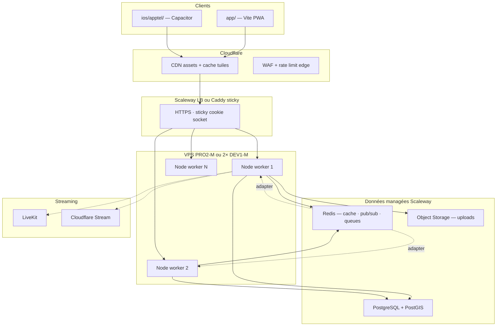

# Stack cible OnScen — montée en charge rapide

> **Document canonique** · juin 2026  
> Complète `msdev/SCALABILITY.md` (checklist 500k) et `docs/INFRA-ONSCEN.md` (état actuel).  
> **Principe : évolution, pas réécriture.** On garde ce qui ship déjà ; on change la couche qui plafonne.

---

## Verdict en une phrase

**Garder React/Vite/Capacitor + TypeScript + Express**, basculer le runtime de **« RAM = base de données »** vers **PostgreSQL + Redis + Object Storage**, et déployer **N workers Node** derrière Caddy — sans migrer vers Next, RN ou Supabase.

---

## Stack actuelle vs stack cible

| Couche | Aujourd'hui | Cible (scale rapide) | Action |
|--------|-------------|----------------------|--------|
| **Web / mobile** | React 19, Vite, Tailwind, PWA, Capacitor 8 | **Identique** | Optimiser bundles (globe lazy ✅) |
| **API** | Express monolithe TS | **Express** (Fastify optionnel phase 3) | Découper modules, pas microservices |
| **Runtime données** | `db` en RAM + flush PG périodique | **PG = source de vérité** pour reads geo/search | Phase 1–2 |
| **Géo / nearby** | Scan Haversine O(n) sur Maps | **PostGIS** `ST_DWithin` + index GiST | Phase 1 — **priorité #1** |
| **Cache** | Maps in-process (20–60 s TTL) | **Redis 7** (nearby, profils, news, rate limits) | Phase 0 |
| **Temps réel** | Socket.io ×1 process | **Socket.io + `@socket.io/redis-adapter`** | Phase 0 (code déjà prêt) |
| **Files / médias** | Disque VPS `/uploads` | **Scaleway Object Storage** (S3 API — code déjà là) | Phase 0 |
| **Recherche** | Scan RAM + index username | **Meilisearch** ou **PG `tsvector` + pg_trgm** | Phase 2 |
| **Jobs async** | `setTimeout` / flush 10 s | **BullMQ** sur Redis (emails, notifs, modération) | Phase 2 |
| **Lives** | LiveKit → Cloudflare Stream | **Identique** | Scale via quotas CF/LK |
| **Paiements** | Stripe Connect | **Identique** | — |
| **Modération** | Sightengine | **Identique** + queue async | Phase 2 |
| **DB** | PG DB-DEV-S (2 Go) | **DB-PRD-S** puis **DB-PRO2-XXS** + **PgBouncer** | Dès 1k DAU |
| **Déploiement** | PM2 fork ×1 | **PM2 cluster** → **Docker Compose** → K8s si >50k CCU | Phase 0 → 3 |
| **CDN** | Caddy sert les assets | **Cloudflare CDN** devant static + tuiles carte | Phase 0 |
| **Observabilité** | Logs PM2, admin panel | **Sentry** + **Prometheus/Grafana** (ou Scaleway Cockpit) | Phase 1 |

---

## Architecture cible (10k → 100k utilisateurs)



---

## Ce qu'on ne change **pas** (et pourquoi)

| Choix | Raison |
|-------|--------|
| **React + Vite** (pas Next.js) | SPA temps réel ; SEO = landing séparée si besoin |
| **Capacitor** (pas React Native) | 95 % code partagé ; vélocité équipe |
| **Express monolithe** (pas 12 microservices) | Salon sync, geo, webhooks, admin dans un seul repo — split only if team >8 |
| **Leaflet + globe Three.js** | Différenciateur produit ; Mapbox = coût + lock-in |
| **LiveKit + Cloudflare** | Déjà externalisé correctement |
| **Scaleway** | Déjà en prod FR ; pas de migration AWS |

---

## Phases de migration

### Phase 0 — Semaine 1–2 (sans changer la logique métier)

**Objectif :** supprimer les single points of failure infra, rester sur 1 codebase.

| Tâche | Fichiers / infra | Effort |
|-------|------------------|--------|
| Activer **Redis** prod (`REDIS_URL`) | `backend/src/lib/socketCluster.ts` déjà prêt ; `@socket.io/redis-adapter`, `redis` en deps prod | 1 j |
| **PM2 cluster** `instances: max`, `exec_mode: cluster` | `commun/deploy/ecosystem.config.cjs` + Caddy sticky sessions | 1 j |
| **S3 uploads** obligatoire prod | `S3_*` dans `.env` · `backend/src/lib/objectStorage.ts` | 2 j |
| **Cloudflare CDN** pour `/assets/*` | Caddy ou CF proxy getsoundy.com | 1 j |
| **PgBouncer** devant PG (mode transaction) | Scaleway console ou sidecar VPS | 1 j |
| Upgrade **DB-PRD-S** si trafic > 500 DAU | Console Scaleway | 0.5 j |
| **Sentry** backend + frontend | `@sentry/node`, `@sentry/react` | 1 j |

**Capacité estimée après Phase 0 :** 2 000–5 000 CCU (connexions simultanées).

---

### Phase 1 — Mois 1–2 (geo + reads PG)

**Objectif :** `/api/geo/nearby` ne scanne plus 10k users en RAM.

| Tâche | Détail |
|-------|--------|
| **PostGIS** | Migration `CREATE EXTENSION postgis` ; colonnes `geography(POINT)` sur `users`, `salons`, `lives` |
| **Nearby SQL** | Remplacer `nearbyPeople.ts` scan par `ST_DWithin(geog, ST_MakePoint(lon,lat)::geography, radius_m)` |
| **Redis cache nearby** | Remplacer `nearbyResponseCache.ts` in-process par Redis (TTL 20 s, clé lat/lon arrondi) |
| **Rate limit Redis** | `rate-limit-redis` sur `/geo/nearby`, `/geo/update`, auth |
| **Pool PG** | `PG_POOL_MAX=20` par worker × N workers ≤ `max_connections` PG |

**Capacité estimée :** 10 000–30 000 CCU ; nearby < 50 ms p95.

---

### Phase 2 — Mois 2–4 (runtime PG-first)

**Objectif :** le boot ne charge plus tout le monde en RAM.

| Tâche | Détail |
|-------|--------|
| **Read path PG** | Profils, feed page 1, search → requêtes PG directes |
| **Write-through** | Garder RAM pour salon playback / socket hot state seulement |
| **BullMQ** | Emails, push, modération Sightengine, flush différé |
| **Meilisearch** (option) | Index users, events, albums — sync via queue |
| **Réplica lecture PG** | Scaleway read replica pour feed + search |

**Capacité estimée :** 50 000–100 000 CCU.

---

### Phase 3 — Mois 6+ (si viralité confirmée)

| Tâche | Détail |
|-------|--------|
| **Kubernetes** (Scaleway Kapsule) ou 2+ VPS + LB | HPA sur CPU / connexions socket |
| **Redis Cluster** | Si > 100k CCU |
| **Séparer workers** | Option : `api` + `socket` + `worker` (3 deployments, même repo) |
| **Aurora-equivalent** | PG scale vertical + réplicas |
| **k6 / Artillery** | Tests charge cible 100k CCU |

---

## Infra Scaleway recommandée par palier

| Palier | Users actifs / CCU | VPS | PostgreSQL | Redis | Coût fixe ~€/mois |
|--------|-------------------|-----|------------|-------|-------------------|
| **A — actuel** | 10 / ~50 CCU | DEV1-S | DB-DEV-S 2 Go | — | ~26 |
| **B — lancement** | 500 DAU / 2k CCU | DEV1-M | DB-PRD-S 4 Go | Redis 1 Go (VPS ou managed) | ~75 |
| **C — croissance** | 5k DAU / 10k CCU | PRO2-M ×1 ou DEV1-M ×2 + LB | DB-PRO2-XXS 8 Go + replica | Redis 2 Go | ~200 |
| **D — viral** | 50k DAU / 100k CCU | Kapsule 3–10 pods | DB-PRO2-S 16 Go | Redis Cluster | ~800–2000 |

> **Coût variable dominant :** Cloudflare Stream + LiveKit si lives massifs — voir `docs/COUT-APPLICATION.md`.

---

## Variables d'environnement cibles (prod)

```bash
# Déjà présents — à activer
DATABASE_URL=postgresql://...
REDIS_URL=redis://...
S3_BUCKET=onscen-uploads
S3_ENDPOINT=https://s3.fr-par.scw.cloud
S3_REGION=fr-par

# Nouveaux
PG_POOL_MAX=20
PGBOUNCER_URL=postgresql://...@127.0.0.1:6432/onscen-prod
POSTGIS_ENABLED=1
MEILISEARCH_URL=http://127.0.0.1:7700
MEILISEARCH_KEY=...
SENTRY_DSN=https://...
PM2_INSTANCES=max
```

---

## Ordre de priorité (si une seule ressource dev)

1. **PostGIS nearby** — goulot #1 identifié (audit CTO, `nearbyPeople.ts`)
2. **Redis + PM2 cluster** — débloque horizontal immédiat
3. **Object Storage uploads** — disque VPS ne scale pas
4. **CDN assets** — 0 CPU Node pour le static
5. **BullMQ** — découple modération / emails des requêtes HTTP
6. Meilisearch / K8s — seulement après métriques prod

---

## Métriques à surveiller avant d'accélérer

| Métrique | Seuil alerte | Action |
|----------|--------------|--------|
| Latence p95 `/api/geo/nearby` | > 200 ms | PostGIS + Redis |
| RAM PM2 | > 70 % 768 Mo | Réduire snapshot RAM ; reads PG |
| Connexions PG | > 80 % max | PgBouncer |
| CPU VPS | > 75 % sustained | +1 worker ou upgrade tier |
| Erreurs WebGL / globe mobile | > 5 % sessions | Perf front (déjà en cours) |
| Coût CF Stream | > budget | Basculer plus de lives en LiveKit mesh |

---

## Références code (état juin 2026)

| Composant | Fichier |
|-----------|---------|
| Store RAM | `backend/src/models/schema.ts` |
| Persistance PG | `backend/src/lib/pgStore.ts`, `persist.ts` |
| Socket cluster (stub) | `backend/src/lib/socketCluster.ts` |
| Nearby scan | `backend/src/lib/nearbyPeople.ts`, `routes/geo.ts` |
| Cache nearby | `backend/src/lib/nearbyResponseCache.ts` |
| Object storage | `backend/src/lib/objectStorage.ts` |
| PM2 prod | `commun/deploy/ecosystem.config.cjs` |
| Plan 500k | `msdev/SCALABILITY.md` |

---

*Prochaine étape recommandée : Phase 0 sur staging (`onscen-staging`) — Redis + PM2 cluster + S3 uploads — puis Phase 1 PostGIS sur branche dédiée.*
