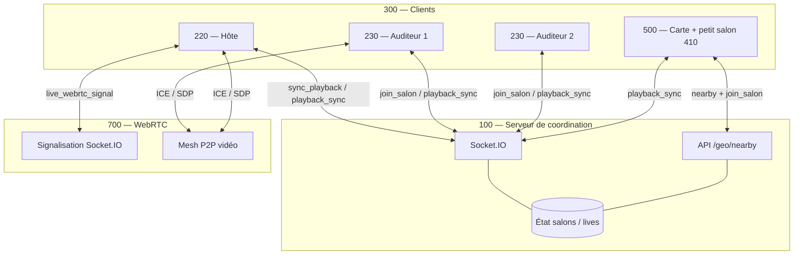
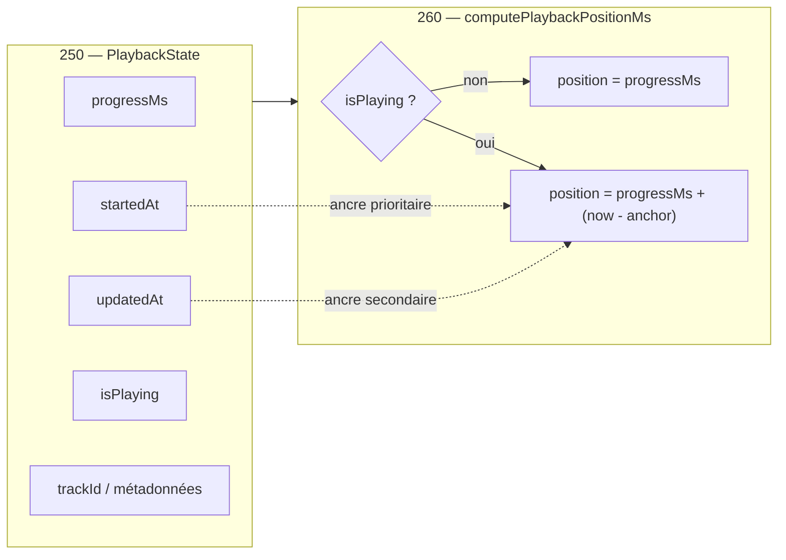
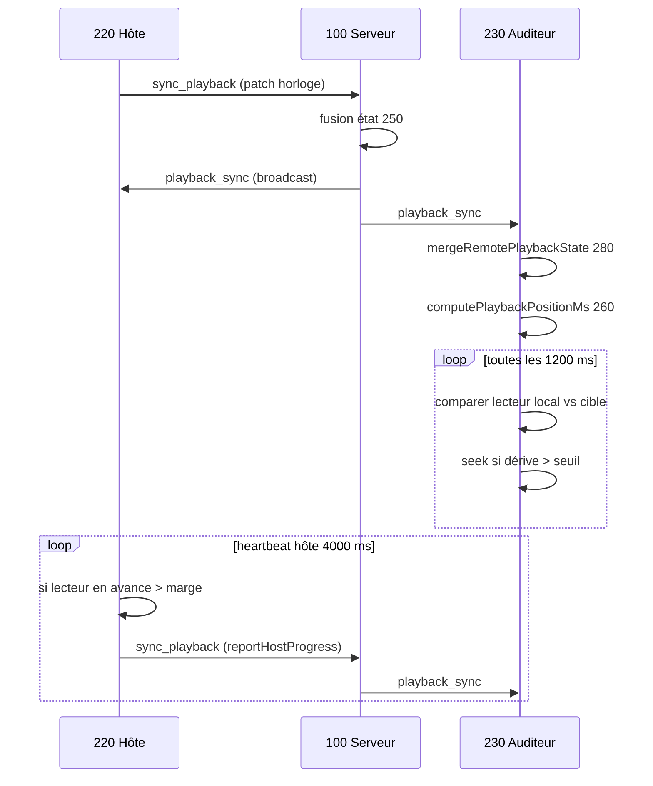
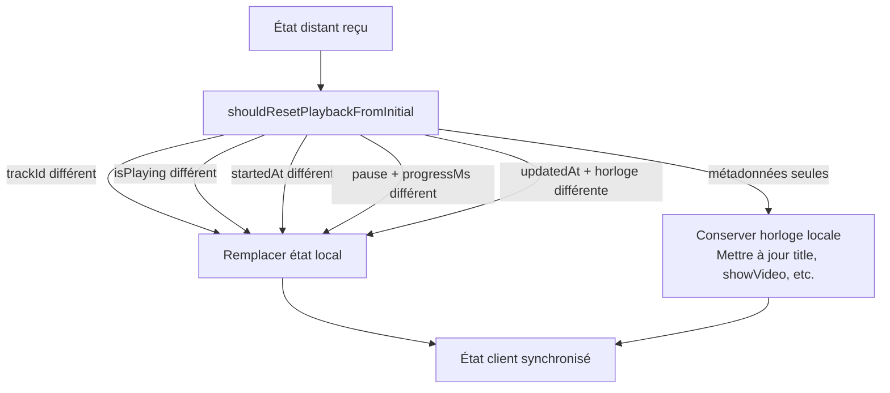
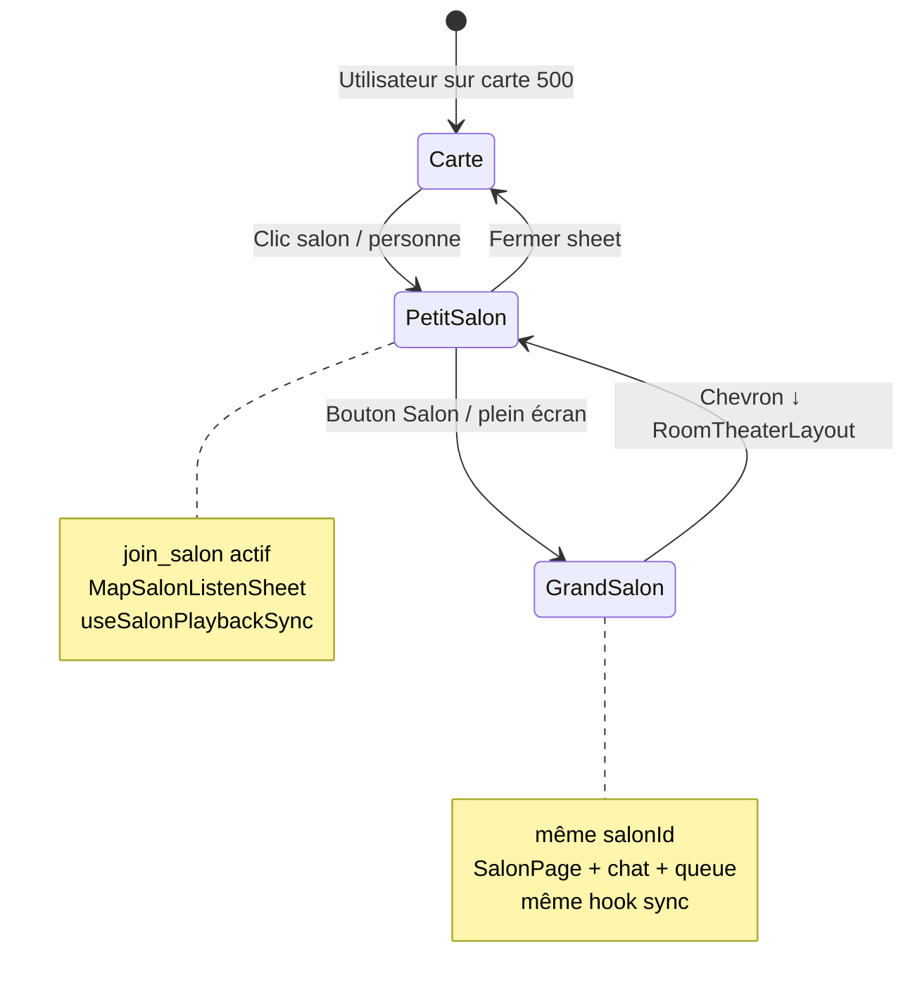
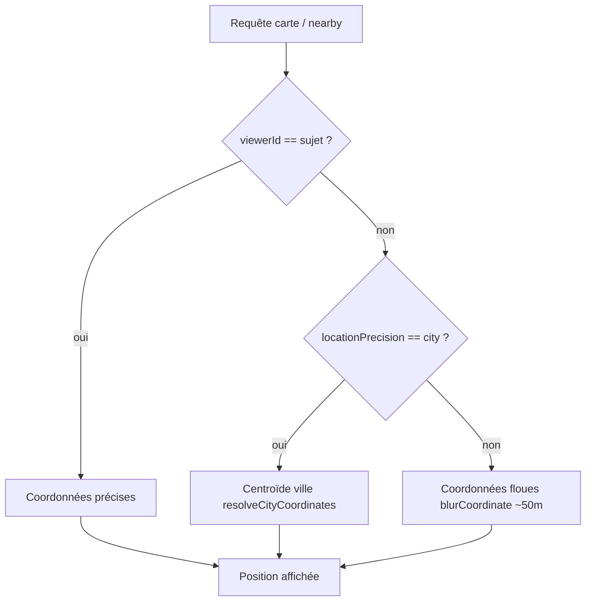
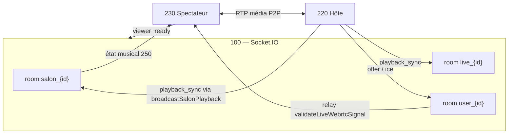

# Descriptions des figures pour dessinateur / mandataire

> Diagrammes Mermaid fournis comme base — à convertir en figures noir et blanc conformes INPI (références numérales, pas de couleur obligatoire).

---

## Fig. 1 — Architecture globale du système

**Description :** Vue d'ensemble montrant le serveur de coordination (100), les salons (200), les clients hôte (220) et auditeurs (230), le module cartographique (500) et le relais WebRTC (700).



**Éléments à légender :** 100, 200, 210 (room), 220, 230, 300, 410, 500, 700.

---

## Fig. 2 — Structure PlaybackState et horloge (250, 260)

**Description :** Schéma de l'état de lecture et formule de calcul de position.



---

## Fig. 3 — Séquence de synchronisation hôte → auditeurs

**Description :** Chronologie des messages lors d'un seek / play par l'hôte.



---

## Fig. 4 — Module de fusion d'état (280)

**Description :** Décision remplacement total vs mise à jour métadonnées seules.



---

## Fig. 5 — Correction de dérive lecteur YouTube (300, 320, 330)

**Description :** Boucles auditeur et hôte dans SalonYouTubePlayer.

```mermaid
flowchart TB
    subgraph Auditeur["230 — Boucle 320"]
        T1["Calcul targetSec depuis 260"]
        T2["Lecture currentTime IFrame 310"]
        T3{|écart| > DRIFT_SEC ?}
        T4["seekTo(targetSec)"]
        T5["play/pause selon isPlaying"]
    end

    subgraph Hote["220 — Heartbeat 330"]
        H1["currentTime si PLAYING"]
        H2{"ms > expected + LEAD_MS ?"}
        H3["reportHostProgress → serveur"]
    end

    T1 --> T2 --> T3
    T3 -->|oui| T4 --> T5
    T3 -->|non| T5
    H1 --> H2
    H2 -->|oui| H3
```

---

## Fig. 6 — Petit salon (410) et grand salon (420)

**Description :** Transition UI sans rupture de session socket.



---

## Fig. 7 — Confidentialité géolocalisation (520)

**Description :** Sélection des coordonnées exposées selon le viewer.



---

## Fig. 8 — Live WebRTC + playback parallèle (700)

**Description :** Deux canaux : signalisation vidéo P2P et bus musical Socket.IO.



---

## Liste des figures pour dépôt INPI

| N° | Titre suggéré | Format |
|---|---|---|
| Fig. 1 | Architecture globale | Schéma bloc |
| Fig. 2 | État de lecture et horloge | Schéma données |
| Fig. 3 | Séquence synchronisation | Diagramme séquence |
| Fig. 4 | Fusion d'état client | Organigramme |
| Fig. 5 | Correction de dérive | Organigramme |
| Fig. 6 | Modes petit/grand salon | Diagramme états |
| Fig. 7 | Confidentialité géographique | Organigramme |
| Fig. 8 | Live WebRTC et playback | Schéma bloc |

**Consignes dessin :** traits continus, références numérales (100, 220…), pas de capture d'écran couleur obligatoire ; les captures UI peuvent compléter en annexe.

---

*Les diagrammes Mermaid peuvent être rendus via [mermaid.live](https://mermaid.live) pour export PNG/SVG.*
