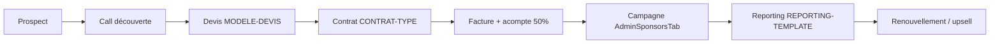

# Documents commerciaux — Sponsoring OnScen

Modèles professionnels pour la vente managed de campagnes sponsoring sur [getsoundy.com](https://getsoundy.com).

> **Tous les documents de ce dossier sont indicatifs.** Validation par un juriste requise avant signature ou envoi définitif à un annonceur.

**Pack avocat (PDF) :** [`../../juridique/dossier-avocat-a-valider/`](../../juridique/dossier-avocat-a-valider/) · régénération : `npm run dossier-avocat --prefix commun/docs/juridique`

---

## Index

| Document | Fichier | Usage |
|----------|---------|-------|
| **Justification tarifs (coûts, point mort)** | [`JUSTIFICATION-TARIFS-SPONSOR-ONSCEN.md`](./JUSTIFICATION-TARIFS-SPONSOR-ONSCEN.md) · PDF [`pdf/`](./pdf/) | BIC, banque — infra, dev, point mort |
| **Synthèse BIC (1 page)** | [`JUSTIFICATION-TARIFS-SPONSOR-SYNTHESE-BIC.md`](./JUSTIFICATION-TARIFS-SPONSOR-SYNTHESE-BIC.md) · PDF [`pdf/`](./pdf/) | Pièce jointe dossier BIC |
| **Modèle de devis** | [`MODELE-DEVIS-SPONSOR.md`](./MODELE-DEVIS-SPONSOR.md) | Proposition commerciale chiffrée (devis seul) |
| **Devis & contrat type** | [`CONTRAT-TYPE-SPONSOR.md`](./CONTRAT-TYPE-SPONSOR.md) | Devis + CGV / conditions contractuelles combinés |
| **Reporting campagne** | [`REPORTING-SPONSOR-TEMPLATE.md`](./REPORTING-SPONSOR-TEMPLATE.md) | Rapport de performance fin de campagne ou mensuel |

---

## Workflow commercial recommandé



---

## Sources tarifaires & produit

Les grilles et formats référencés dans ces modèles proviennent de :

| Source | Contenu |
|--------|---------|
| [`../ONE-PAGER-SPONSOR-COMMERCIAL.md`](../ONE-PAGER-SPONSOR-COMMERCIAL.md) | 5 emplacements + packs, forfait / semaine sans CPM |
| [`../ETUDE-MARCHE-BUSINESS-PLAN-PARTENAIRES.md`](../ETUDE-MARCHE-BUSINESS-PLAN-PARTENAIRES.md) | Formule CPM, packages mensuels, paliers audience |
| [`../../PLAN-SPONSORING-PAYANT.md`](../../PLAN-SPONSORING-PAYANT.md) | Grilles managed/self-serve, KPIs, specs créatives |
| `web/app/src/lib/sponsorPricing.ts` | CPM par emplacement et paliers inscrits (code produit) |

---

## Emplacements OnScen (offre commerciale lancement · 5 + packs)

| Code | Nom commercial |
|------|----------------|
| `feed_inline` | Fil d'actualité |
| `map_banner` | Carte · bandeau |
| `map_sidebar_events` | Carte · icône Sponso |
| `reels_sponsored` | Reel sponsorisé |
| `music_tab` | Onglet Musique *(commercialisation selon dispo technique)* |

Autres emplacements produit (hors offre standard actuelle) : `stories_banner`, `stories_sponsored`, `salon_theater`.

---

## Grilles tarifaires intégrées (indicatif · sans CPM)

- **Unité :** forfait **/ semaine / emplacement** (99 – 149 € HT selon format)
- **Packs :** Carte 199 € · Actu & Reel 249 € · Musique & Actu 229 € · Complet 499 € / semaine
- **Remise :** −10 % sur un même pack × 4 semaines consécutives
- *Évolution future possible vers CPM une fois audience mesurable — voir modèles devis/contrat*

---

## Placeholders communs

| Placeholder | Description |
|-------------|-------------|
| `[ANNONCEUR]` | Raison sociale client |
| `[SIRET]` | SIRET annonceur |
| `[CONTACT]` | Nom du contact commercial client |
| `[RAISON_SOCIALE_SOUNDY]` | Éditeur / prestataire |
| `[DATE_DEBUT]` / `[DATE_FIN]` | Période campagne |
| `[ZONE_GEO]` | Ciblage ville / région / France |
| `[TOTAL_HT_NET]` | Montant HT après remise |

---

## PDF

Les modèles sont rédigés en **Markdown** (source de vérité). Génération PDF tarifs / justification :

```powershell
npm run tarifs-sponsor-pdf --prefix commun/docs/strategie
```

Sortie : `commercial/pdf/` (document complet + synthèse BIC). Les mêmes sources sont aussi exportées dans le dossier avocat (`07-annexes-produit/`) via `npm run dossier-avocat --prefix commun/docs/juridique`.

---

*OnScen · Dossier commercial sponsors · Juillet 2026*
