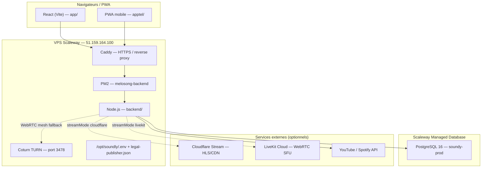
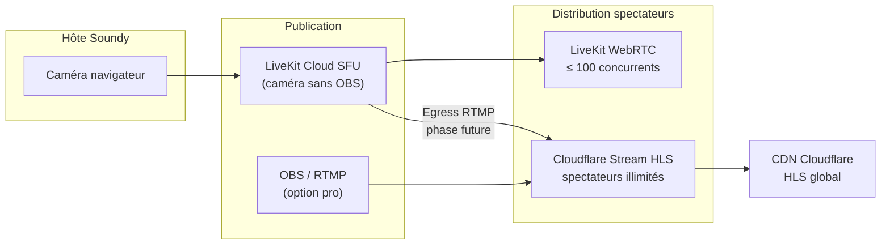

# Coûts et architecture — Soundy / MeloSongv2

Document de référence pour l’infrastructure, les modes de diffusion live et les estimations budgétaires par stade de croissance.

> **Dernière mise à jour :** juin 2026  
> **Production :** [getsoundy.com](https://getsoundy.com) · VPS `51.159.164.100` · chemin `/opt/soundly`  
> **Aucun secret** (tokens, mots de passe, clés API) ne figure dans ce document.

---

## 1. Vue d'ensemble Soundy

Soundy (MeloSongv2) est une application web de **salons musicaux synchronisés**, **lives vidéo** et **fil d’actualité**, accessible en production sur **getsoundy.com**.

### Architecture production



### Stack technique

| Couche | Technologie | Rôle |
|--------|-------------|------|
| Frontend | React + Vite (`app/`, `apptel/`) | UI web et PWA mobile |
| Backend | Node.js + Express + Socket.io | API REST, temps réel, OAuth |
| Persistance prod | PostgreSQL Scaleway Managed | Users, DMs, fil, stories, etc. |
| Persistance dev | `msdev/data/store.json` | Données locales msdev uniquement |
| Process manager | PM2 (`deploy/ecosystem.config.cjs`) | Autorestart, logs, zero-downtime reload |
| Reverse proxy | Caddy (`deploy/Caddyfile`) | HTTPS getsoundy.com, Basic Auth UI |
| WebRTC relay | Coturn (même VPS) | TURN pour mesh WebRTC derrière NAT |
| Déploiement | `scripts/deploy-prod.ps1` → `deploy_zero_downtime.ps1` | Build + sync VPS + `pm2 reload` |

### Environnements

| | **DEV (msdev)** | **PROD** |
|---|-----------------|----------|
| URL | http://localhost:5173 | https://getsoundy.com |
| API | http://localhost:4080 | https://getsoundy.com/api |
| `APP_ENV` | `msdev` | `production` |
| Données | `msdev/data/` (local) | PostgreSQL Scaleway |
| Lancement | `npm run dev` | `scripts/deploy-prod.ps1` |

Références : [`docs/DEV-WORKFLOW.md`](DEV-WORKFLOW.md), [`deploy/RUNBOOK-PROD.md`](../deploy/RUNBOOK-PROD.md).

---

## 2. Coûts infrastructure fixes (mensuels)

Coûts récurrents indépendants du volume de spectateurs live (hors bande passante streaming variable).

| Poste | Estimation mensuelle | Détail |
|-------|---------------------|--------|
| **VPS Scaleway** | ~8–12 € | Instance type DEV1-S ou équivalent (Paris `fr-par`) — Node, Caddy, PM2, Coturn, backups locaux. Réf. deploy : DEV1-S ~1,9 Go RAM suffisant pour app seule ; Postgres sur le même VPS déconseillé en prod. |
| **PostgreSQL Managed Scaleway** | ~15 € | Plan **DB-DEV-S** (1 vCPU, 2 Go RAM, 10 Go SSD) — instance `soundy-prod`, région Paris. Whitelist IP VPS `51.159.164.100/32`. |
| **Domaine getsoundy.com** | ~1 € | Renouvellement annuel ~10–15 €/an (registrar variable). DNS géré côté registrar / Cloudflare selon config. |
| **Coturn (TURN WebRTC)** | **Inclus** | Service Coturn sur le même VPS (`51.159.164.100:3478`) — pas de coût SaaS séparé ; consomme CPU/bande passante VPS. |
| **Cloudflare Stream** | **0 € fixe** | Pay-as-you-go à la consommation (voir §3.2). |
| **LiveKit Cloud Build** | **0 € fixe** | Quota gratuit (voir §3.3) ; Ship ~50 $/mois si dépassement. |
| **iCloud / outils dev** (optionnel) | ~0–30 € | iCloud Drive (sync), Cursor, GitHub (gratuit), compte Apple dev (99 €/an si app native iOS — futur). Non requis pour la prod web. |

### Total infrastructure fixe estimé (prod minimale)

| Scénario | Mensuel |
|----------|---------|
| **MVP prod** (VPS + DB + domaine) | **~24–28 €/mois** |
| **+ LiveKit Ship** (si quota dépassé) | **+ ~46 €/mois** (~50 $) |
| **+ outils dev optionnels** | variable |

> Les sauvegardes PostgreSQL Scaleway (automatiques console) et les dumps VPS (`deploy/backup-db.sh`, cron 03:15) sont inclus dans les plans respectifs sans surcoût significatif au stade MVP.

### Tableau de bord admin — onglet « Coût »

Dans l’interface **Administration** (compte admin), l’onglet **Coût** (`app/src/pages/AdminCostsTab.tsx`) affiche :

- Les **coûts fixes** et grilles tarifaires LiveKit / Cloudflare (résumé de ce document)
- Les **coûts Cloudflare en temps réel** via `GET /api/admin/cloudflare-usage` (minutes livrées GraphQL, stockage, live inputs actifs, estimation USD/EUR du mois en cours)
- Une **estimation mensuelle totale** : infra fixe (~24–28 €) + variable Cloudflare

> LiveKit n’expose pas d’API billing publique dans l’app : surveiller le [dashboard LiveKit](https://cloud.livekit.io) pour les quotas Build / Ship.

---

## 3. Modes de diffusion live — comparaison

Trois modes exclusifs par live, choisis automatiquement à la création selon la configuration serveur (voir §9).

### 3.1 Mesh WebRTC actuel (legacy / fallback)

| Critère | Valeur |
|---------|--------|
| **Coût streaming** | **0 €** (infrastructure VPS + Coturn déjà payés) |
| **Limite spectateurs** | **~30** (`LIVE_WEBRTC_MESH_VIEWER_LIMIT` dans `app/src/lib/liveVideoRelay.ts`) |
| **Caméra hôte** | Navigateur — une `RTCPeerConnection` par spectateur |
| **Spectateurs** | WebRTC P2P mesh hôte → N viewers |
| **Activation** | Par défaut si LiveKit **et** Cloudflare Stream non configurés |

**Problèmes connus :**

- Bande passante **upload** de l’hôte = goulot d’étranglement (N flux sortants).
- Qualité dégradée au-delà de ~15–20 spectateurs sur connexion domestique.
- Consommation CPU/batterie élevée côté hôte.
- NAT / pare-feu : dépendance au serveur **TURN** (Coturn sur VPS).
- Pas de CDN : chaque spectateur consomme de la bande passante hôte.
- Fichier vidéo local hôte : aperçu hôte uniquement, **non relayé** aux spectateurs.

**Quand l’utiliser :** dev local, tests, très petits lives (< 10 spectateurs), ou secours si services cloud indisponibles.

---

### 3.2 Cloudflare Stream (configuré en prod)

| Critère | Valeur |
|---------|--------|
| **Coût fixe** | **0 $/mois** |
| **Modèle** | Pay-as-you-go |
| **Ingest** | RTMP/RTMPS (OBS, Streamlabs, etc.) — **gratuit** |
| **Spectateurs** | **Illimités** via HLS/CDN Cloudflare |
| **Caméra navigateur directe** | Non (OBS requis actuellement ; WHIP phase 2) |
| **Activation prod** | Variables `.env` sur `/opt/soundly/.env` |

**Variables d'environnement :**

| Variable | Description |
|----------|-------------|
| `CLOUDFLARE_ACCOUNT_ID` | ID compte (barre latérale dashboard Cloudflare) |
| `CLOUDFLARE_STREAM_API_TOKEN` | Token API — permission **Account → Stream → Edit** |
| `CLOUDFLARE_STREAM_CUSTOMER_SUBDOMAIN` | Partie `XXX` de `customer-XXX.cloudflarestream.com` |
| `CLOUDFLARE_USD_EUR_RATE` | Taux USD→EUR pour estimations admin (défaut `0.92`) |

**Tarification Cloudflare Stream (2026) :**

| Poste | Tarif |
|-------|-------|
| Ingest RTMP | **Gratuit** |
| Minutes visionnées (delivery HLS) | **1 $ / 1 000 minutes** |
| Stockage vidéo (VOD / enregistrements) | **5 $ / 1 000 minutes stockées / mois** |

**Estimations par volume** (hypothèse : live moyen **45 min**, spectateurs regardent en moyenne **80 %** de la durée) :

| Spectateurs / live | Minutes visionnées / live (45 min × 80 %) | Coût / live | 10 lives/mois | 50 lives/mois |
|--------------------|-------------------------------------------|-------------|---------------|---------------|
| 50 | 1 800 min | ~1,80 $ | ~18 $ | ~90 $ |
| 200 | 7 200 min | ~7,20 $ | ~72 $ | ~360 $ |
| 500 | 18 000 min | ~18 $ | ~180 $ | ~900 $ |
| 1 000 | 36 000 min | ~36 $ | ~360 $ | ~1 800 $ |
| 10 000 | 360 000 min | ~360 $ | ~3 600 $ | ~18 000 $ |

**Liens utiles :**

- Dashboard : [dash.cloudflare.com](https://dash.cloudflare.com)
- Tokens API : [dash.cloudflare.com/profile/api-tokens](https://dash.cloudflare.com/profile/api-tokens)
- Stream API : [developers.cloudflare.com/stream](https://developers.cloudflare.com/stream/)
- Live Inputs : Stream → Live Inputs dans le dashboard

**Endpoints backend :**

- `POST /api/lives/:id/cloudflare-stream` — provisionner le live input
- `GET /api/lives/:id/cloudflare-ingest` — credentials RTMP (hôte)
- `GET /api/lives/:id/playback` — URL HLS spectateurs

---

### 3.3 LiveKit Build (en déploiement)

| Critère | Valeur |
|---------|--------|
| **Coût fixe** | **0 $/mois** (plan Build) |
| **Quota gratuit** | **100 connexions concurrentes**, **5 000 min/mois** (minutes participant) |
| **Caméra hôte** | **Navigateur** — sans OBS |
| **Spectateurs** | WebRTC via SFU LiveKit (qualité adaptative) |
| **Dépassement quota** | Plan **Ship ~50 $/mois** |
| **Priorité code** | **#1** si configuré (voir §9) |

**Variables d'environnement :**

| Variable | Description |
|----------|-------------|
| `LIVEKIT_URL` | URL WebSocket (`wss://xxx.livekit.cloud`) |
| `LIVEKIT_API_KEY` | Clé API LiveKit |
| `LIVEKIT_API_SECRET` | Secret API LiveKit |

**Dashboard :** [cloud.livekit.io](https://cloud.livekit.io) → Create project → Settings → Keys.

**Endpoint backend :** `GET /api/lives/:id/livekit-token` — token publish (hôte) ou subscribe (spectateur).

**Packages frontend :** `livekit-client`, `@livekit/components-react` (`app/package.json`).

**Limites plan Build :**

- 100 participants **simultanés** sur l’ensemble du projet (hôte + spectateurs).
- 5 000 minutes participant/mois (ex. 1 hôte + 19 spectateurs × 45 min = 900 min/live).
- Au-delà : migration Ship ou bascule Cloudflare pour grands événements.

---

### 3.4 Hybride recommandé (LiveKit + Cloudflare)

> **État actuel du code :** un seul `streamMode` par live (`livekit` **ou** `cloudflare` **ou** `webrtc`). Les deux services peuvent être configurés simultanément ; la **priorité LiveKit** s’applique à la création. L’hybride ci-dessous décrit la **stratégie cible** pour la montée en charge.

#### Schéma de flux recommandé



#### Stratégie par taille d’audience

| Audience | Mode recommandé | Raison |
|----------|-----------------|--------|
| < 30 spectateurs | LiveKit Build | Caméra navigateur, latence faible, gratuit |
| 30–100 spectateurs | LiveKit Build | Dans le quota connexions concurrentes |
| 100–10 000+ | Cloudflare Stream (OBS ou egress LiveKit) | CDN HLS, coût linéaire prévisible |
| Secours / dev | Mesh WebRTC | Aucune config cloud requise |

#### Coûts combinés (exemple mensuel)

| Profil | LiveKit | Cloudflare | Infra fixe | **Total estimé** |
|--------|---------|------------|------------|------------------|
| Petit (LiveKit seul, dans quota) | 0 $ | 0 $ | ~25 € | **~25 €** |
| Moyen (LiveKit Ship + CF ponctuel) | 50 $ | ~50 $ | ~25 € | **~125 €** |
| Grand (CF dominant, 500 spec. × 50 lives) | 0–50 $ | ~900 $ | ~25 € | **~950 €** |

---

## 4. Salons YouTube / Spotify

Les **salons musicaux synchronisés** (YouTube ou Spotify) sont distincts des lives vidéo caméra.

| Critère | Valeur |
|---------|--------|
| **Limite participants** | **Aucune limite codée** — tous les utilisateurs authentifiés peuvent rejoindre |
| **Durée maximale** | **2 heures** (`SALON_MAX_DURATION_MS = 2 × 60 × 60 × 1000` — `SalonPage.tsx`) |
| **Fermeture auto** | Message UI + fermeture à expiration |
| **Coût streaming supplémentaire** | **Aucun** — lecture via API YouTube / Spotify côté client |
| **Coûts API** | Quotas gratuits YouTube Data API / Spotify Web API (OAuth hôte) |
| **Sync playback** | Socket.io — pas de relais média serveur |

> Les salons ne passent **pas** par Cloudflare Stream, LiveKit ou le mesh WebRTC vidéo (sauf si l’hôte démarre un live caméra lié au salon).

---

## 5. Bots

Les **bots carte monde** alimentent la démo msdev (carte, fil, salons simulés).

| Critère | Valeur |
|---------|--------|
| **Environnement** | **msdev uniquement** (`APP_ENV=msdev`, `isLocalDevEnvironment()`) — **pas en production** |
| **Données** | Seed `msdev` / `backend/src/seed-bots.ts` — `store.json` local |
| **Cloudflare / LiveKit** | **Non utilisés** — pas de flux vidéo réel |
| **Lives bots** | Présentation UI (`cameraActive: true`) sans WebRTC ni HLS |
| **Configuration** | `MSDEV_BOT_COUNT` (défaut 10 000 ; `0` = 8 bots Paris legacy), `MSDEV_BOT_LIVE_PERCENT` (défaut 10 %), `MSDEV_BOT_LIVE_COUNT` (optionnel), cap **80 lives** bots |

Les bots simulent des **salons Spotify/YouTube** et des **marqueurs LIVE** sur la carte pour le développement et les démos locales. Ils n’impactent **pas** les coûts de streaming production.

---

## 6. Tableaux d'estimation par scénario

**Hypothèses communes :**

- Durée moyenne live caméra : **45 minutes**
- Taux de visionnage moyen : **80 %** de la durée (36 min effectives/spectateur)
- Lives caméra vidéo uniquement (pas les salons Spotify/YouTube)
- Infra fixe : **~25 €/mois** (VPS + PostgreSQL + domaine)
- Taux de change indicatif : **1 $ ≈ 0,92 €**

### Scénario Startup — 10 lives/mois, 20 spectateurs/live

| Mode | Coût streaming/mois | Infra fixe | **Total/mois** |
|------|---------------------|------------|----------------|
| Mesh WebRTC | 0 € | ~25 € | **~25 €** |
| LiveKit Build | 0 € *(~7 200 min participant — quota 5 000 dépassé → Ship)* | ~25 € | **~25 €** ou **~71 €** avec Ship |
| Cloudflare Stream | ~7 € *(720 min × 10 lives = 7 200 min → ~7 $)* | ~25 € | **~32 €** |
| Hybride (LiveKit + CF backup) | ~7 € | ~25 € | **~32 €** |
| Bunny Stream *(alternative)* | ~5–6 € *(~0,005 $/min delivery)* | ~25 € | **~30 €** |

### Scénario Croissance — 50 lives/mois, 200 spectateurs/live

| Mode | Coût streaming/mois | Infra fixe | **Total/mois** |
|------|---------------------|------------|----------------|
| Mesh WebRTC | **Impossible** (> 30 spec.) | — | — |
| LiveKit Build | **Quota dépassé** → Ship ~46 € | ~25 € | **~71 €** *(max 100 concurrents/live)* |
| Cloudflare Stream | ~332 € *(360 000 min → ~360 $)* | ~25 € | **~357 €** |
| Hybride | ~46 € (LK) + ~50 € (CF grands lives) | ~25 € | **~120 €** |
| Bunny Stream | ~250–280 € | ~25 € | **~275 €** |

### Scénario Scale — 100 lives/mois, 500 spectateurs/live

| Mode | Coût streaming/mois | Infra fixe | **Total/mois** |
|------|---------------------|------------|----------------|
| Mesh WebRTC | **Impossible** | — | — |
| LiveKit Build | Ship ~46 € *(limite 100 concurrents)* | ~25 € | **~71 €** *(insuffisant seul)* |
| Cloudflare Stream | ~1 656 € *(1,8 M min → ~1 800 $)* | ~25 € | **~1 681 €** |
| Hybride | Ship + CF egress | ~25 € | **~500–800 €** *(selon répartition)* |
| Bunny Stream | ~1 200–1 400 € | ~25 € | **~1 225 €** |

### Scénario Grand — 1 000+ spectateurs/live

| Mode | Coût / live (1 000 spec., 45 min) | Recommandation |
|------|-----------------------------------|----------------|
| Mesh WebRTC | **Impossible** | — |
| LiveKit Build | **Impossible** (> 100 concurrents) | — |
| Cloudflare Stream | ~33 €/live *(36 000 min)* | **Recommandé** |
| Bunny Stream | ~25 €/live | Alternative économique |
| Mux | ~40–50 €/live | Alternative premium (analytics) |

> **PostgreSQL :** au stade Scale, envisager **DB-PRD-S (~50 €/mois)** et `PG_POOL_MAX=20` (voir `deploy/README.md`).

---

## 7. Comparaison Instagram / TikTok

| Aspect | Instagram Live / TikTok Live | Soundy (cible LiveKit) |
|--------|-------------------------------|------------------------|
| **Encodage** | Intégré dans l’app native | LiveKit : encodeur navigateur (WebRTC) |
| **Ingest** | RTMP interne → CDN propriétaire | RTMP Cloudflare (OBS) ou WebRTC LiveKit |
| **Distribution** | CDN global, millions de viewers | Cloudflare HLS CDN (illimité) ou LiveKit SFU |
| **OBS requis** | **Non** — caméra app | **Non** avec LiveKit ; **Oui** avec Cloudflare seul (aujourd’hui) |
| **Latence** | ~3–10 s (HLS) / faible (WebRTC interne) | LiveKit ~1–3 s ; Cloudflare HLS ~10–30 s |
| **Coût infra** | Absorbé par Meta / ByteDance | Pay-as-you-go Cloudflare / LiveKit |

**Ce que Soundy vise avec LiveKit :** une expérience **« un tap pour live caméra »** comparable aux réseaux sociaux, sans OBS, tout en conservant la **montée en charge CDN** (Cloudflare) pour les audiences massives — le meilleur des deux mondes décrit en §3.4.

---

## 8. Liens utiles (connexions et inscriptions)

### Application

| Ressource | URL |
|-----------|-----|
| **Production Soundy** | https://getsoundy.com |
| **Health check** | https://getsoundy.com/health |
| **Inscription / connexion** | https://getsoundy.com (UI auth) |

### Infrastructure

| Ressource | URL / accès |
|-----------|-------------|
| **VPS SSH** | `ssh root@51.159.164.100` (clé `~/.ssh/id_ed25519`) |
| **Chemin application** | `/opt/soundly` |
| **Console Scaleway** | https://console.scaleway.com |
| **Managed Database** | Console → Managed Databases → `soundy-prod` |
| **GitHub (dépôt)** | https://github.com/valentingoulven-creator/Melo |

### Streaming live

| Service | Dashboard / inscription |
|---------|------------------------|
| **Cloudflare** | https://dash.cloudflare.com |
| **Cloudflare API tokens** | https://dash.cloudflare.com/profile/api-tokens |
| **Cloudflare Stream docs** | https://developers.cloudflare.com/stream/ |
| **LiveKit Cloud** | https://cloud.livekit.io |
| **LiveKit docs** | https://docs.livekit.io |

### Alternatives streaming (référence)

| Service | URL | Usage typique |
|---------|-----|---------------|
| **Bunny Stream** | https://bunny.net/stream/ | CDN vidéo low-cost, RTMP ingest |
| **Mux** | https://www.mux.com | Live + VOD, analytics, API developer-first |

### OAuth / plateformes musicales

| Plateforme | Console développeur |
|------------|---------------------|
| **Spotify** | https://developer.spotify.com/dashboard |
| **Google / YouTube** | https://console.cloud.google.com |
| **Stripe** (dons / abos) | https://dashboard.stripe.com |

### Documentation interne

| Document | Chemin |
|----------|--------|
| Workflow dev | [`docs/DEV-WORKFLOW.md`](DEV-WORKFLOW.md) |
| Runbook prod | [`deploy/RUNBOOK-PROD.md`](../deploy/RUNBOOK-PROD.md) |
| Setup PostgreSQL | [`deploy/README.md`](../deploy/README.md) |
| Exemple `.env` prod | [`backend/.env.production.example`](../backend/.env.production.example) |

---

## 9. Priorité `streamMode` dans le code

À la **création d’un live**, le backend sélectionne automatiquement le mode via `defaultLiveStreamMode()` :

```typescript
// backend/src/lib/liveStreamMode.ts
/** Priority: LiveKit Cloud > Cloudflare Stream > WebRTC mesh fallback. */
export function defaultLiveStreamMode(): LiveStreamMode {
  if (isLiveKitConfigured()) return 'livekit';
  if (isCloudflareStreamConfigured()) return 'cloudflare';
  return 'webrtc';
}
```

| Priorité | Mode | Condition |
|----------|------|-----------|
| **1** | `livekit` | `LIVEKIT_URL` + `LIVEKIT_API_KEY` + `LIVEKIT_API_SECRET` définis |
| **2** | `cloudflare` | `CLOUDFLARE_ACCOUNT_ID` + `CLOUDFLARE_STREAM_API_TOKEN` (+ subdomain) |
| **3** | `webrtc` | Fallback mesh + Coturn |

**Comportements associés :**

- Cloudflare : provisionnement auto du Live Input à la création (`provisionCloudflareStreamForLive`).
- LiveKit : token JWT via `/lives/:id/livekit-token` ; room = `live-{liveId}`.
- WebRTC mesh : signalisation Socket.io + ICE servers (STUN Google + TURN VPS).

**Durée max live caméra :** 8 heures (`LIVE_MAX_DURATION_MS` — `LivePage.tsx`), distincte de la limite salon 2 h.

---

## 10. Recommandations par stade de croissance

### Phase 0 — Lancement / MVP (< 100 users actifs)

- **Infra :** VPS DEV1-S + PostgreSQL DB-DEV-S (~25 €/mois).
- **Live vidéo :** Mesh WebRTC ou LiveKit Build (gratuit, caméra navigateur).
- **Action :** Configurer LiveKit sur `/opt/soundly/.env` ; tester caméra sans OBS.
- **Éviter :** Postgres sur le même VPS que Node.

### Phase 1 — Traction (10–50 lives/mois, < 30 spectateurs)

- **Live vidéo :** **LiveKit Build** prioritaire (caméra navigateur, 0 €).
- **Surveiller :** Quota 5 000 min/mois et 100 connexions concurrentes.
- **Backup :** Garder Cloudflare Stream configuré pour bascule OBS si quota dépassé.

### Phase 2 — Croissance (50–200 spectateurs/live)

- **Live vidéo :** **Cloudflare Stream** pour les lives > 30 spectateurs (OBS ou egress futur).
- **Coût streaming :** budget ~100–400 €/mois selon volume (voir §6).
- **Infra :** Activer backups auto Scaleway ; cron `verify-prod.sh` hebdo.
- **DB :** Surveiller connexions ; rester sur DB-DEV-S si < 1k users actifs.

### Phase 3 — Scale (500+ spectateurs, 100+ lives/mois)

- **Live vidéo :** **Cloudflare HLS** systématique pour distribution ; LiveKit pour preview/interaction si besoin.
- **Infra :** Migrer PostgreSQL → **DB-PRD-S** (~50 €/mois), `PG_POOL_MAX=20`.
- **Optimisation :** Comparer Bunny Stream vs Cloudflare sur un échantillon de lives.
- **Monitoring :** Dashboard Cloudflare Stream (minutes visionnées), alertes budget.

### Phase 4 — Grand public (1 000–10 000+ spectateurs)

- **Live vidéo :** Cloudflare CDN exclusivement ; encoder RTMP professionnel ou egress LiveKit → RTMP.
- **Coût streaming :** poste budgétaire principal (~1–20 k€/mois selon volume).
- **Infra :** DB-PRD-M+, pgBouncer, CDN assets statiques Cloudflare.
- **Produit :** Encodeur intégré app (comme TikTok) via LiveKit SDK mobile.

---

## Annexe — Formules de calcul rapide

```
Minutes visionnées Cloudflare = lives × spectateurs × durée_min × taux_visionnage
Coût Cloudflare ($)          = minutes_visionnées / 1000 × 1

Minutes participant LiveKit   = lives × (1 hôte + spectateurs) × durée_min
Quota Build                   = 5 000 min/mois + 100 connexions simultanées

Coût infra fixe (€)           ≈ VPS (8–12) + PostgreSQL (15) + domaine (1)
```

---

*Document généré pour MeloSongv2 / Soundy — ne pas committer de secrets. Mettre à jour ce fichier lors de changements tarifaires ou d’architecture.*
