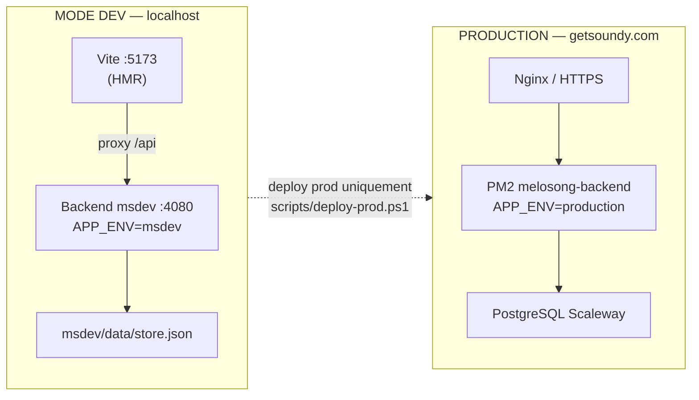

# Workflow développement — Soundy / MeloSongv2


Recommandations pour éviter les conflits iCloud, garder un dépôt sain et déployer en production sans surprise.


---


## Dev vs Prod (vue d'ensemble)





| | **DEV** | **PROD** |

|---|---------|----------|

| URL app | http://localhost:5173 | https://getsoundy.com |

| API | http://localhost:4080 | https://getsoundy.com/api |

| `APP_ENV` | `msdev` | `production` |

| Données | `msdev/data/` (local) | PostgreSQL VPS |

| Lancement | `npm run dev` | Dire **« deploy prod »** à l'agent ou lancer le script |

| Deploy | — | `scripts/deploy-prod.ps1` |


---


## Lancer l'app en DEV


Depuis la racine `MeloSongv2/` :


```powershell

npm run dev

```


Équivalents :


```powershell

powershell -ExecutionPolicy Bypass -File scripts/dev-start.ps1

powershell -ExecutionPolicy Bypass -File msdev/LANCER-DEV.ps1

```


Ce que fait le script :


1. Affiche **MODE DEV — pas la prod**

2. Démarre le backend msdev sur le port **4080** (`APP_ENV=msdev`, `msdev/.env`)

3. Démarre le frontend Vite sur le port **5173** (proxy API vers :4080)

4. Ouvre le navigateur sur http://localhost:5173


Variables frontend dev : `app/.env.development` (`VITE_APP_ENV=msdev`, `VITE_WEB_APP_URL=http://localhost:5173`).


> **Note** : `npm run msdev` reste disponible (build statique + backend seul sur :4080). Pour le développement quotidien avec rechargement à chaud, préférer **`npm run dev`**.


---


## Déployer en PROD


**Commande canonique** (ou dire **« deploy prod »** à l'agent Cursor) :


```powershell

powershell -ExecutionPolicy Bypass -File scripts/deploy-prod.ps1

```


Double-clic : `deploy-prod.bat` à la racine.


Le script :


1. Affiche la bannière **DEPLOY PRODUCTION → getsoundy.com**

2. Vérifie les changements Git non commités (avertissement ; `-AskCommit` pour confirmer)

3. Appelle `deploy_zero_downtime.ps1 -VerifyProd`


Options utiles :


```powershell

# Ignorer build backend ou frontend

powershell -ExecutionPolicy Bypass -File scripts/deploy-prod.ps1 -SkipBuild

powershell -ExecutionPolicy Bypass -File scripts/deploy-prod.ps1 -SkipFrontend


# Demander confirmation si le dépôt n'est pas propre

powershell -ExecutionPolicy Bypass -File scripts/deploy-prod.ps1 -AskCommit

```


---


## Emplacement du dépôt


**Ne pas développer dans iCloud Drive** (`Application\MeloSong\...`) pour le travail quotidien : sync lente, fichiers verrouillés, risque de corruption sur `msdev/data/store.json`.


Recommandé :


```text

C:\Dev\MeloSongv2

```


Cloner une fois :


```powershell

mkdir C:\Dev -ErrorAction SilentlyContinue

git clone https://github.com/valentingoulven-creator/Melo.git C:\Dev\MeloSongv2

cd C:\Dev\MeloSongv2

```


Ouvrir ce dossier dans Cursor comme workspace racine.


---


## Boucle de travail


1. **Branche / master** — petits commits logiques (message clair, pas de secrets).

2. **`git push`** après chaque lot de modifications testé localement.

3. **Dev local** — `npm run dev` (voir ci-dessus).


   Données msdev : `msdev/data/` (ignoré par Git, ne pas synchroniser via iCloud).


4. **CI** — chaque push sur `master` déclenche `.github/workflows/ci.yml` (install + `tsc` app + build backend). Corriger avant deploy si la CI est rouge.


5. **Production** — `scripts/deploy-prod.ps1` ou **« deploy prod »** à l'agent (règle `.cursor/rules/deploy-prod.mdc`).


---


## Variables d'environnement (clarté)


| Fichier | Committé | Rôle |

|---------|----------|------|

| `app/.env.development` | oui | Vite dev : `VITE_APP_ENV=msdev`, `VITE_WEB_APP_URL` |

| `app/.env.production` | oui | Build prod : `VITE_APP_ENV=production`, `https://getsoundy.com` |

| `msdev/.env` | **non** (gitignore) | Secrets et config backend msdev local |


Ne jamais committer de secrets (JWT, clés API, `DATABASE_URL` prod, etc.).


---


## Premier setup VPS (une fois)


Voir [`deploy/RUNBOOK-PROD.md`](../deploy/RUNBOOK-PROD.md). Résumé :


```bash

# Sur le VPS (root)

bash /opt/soundly/deploy/setup-legal-publisher.sh   # puis éditer legal-publisher.json

sudo bash /opt/soundly/deploy/install-backup-cron.sh

sudo bash /opt/soundly/deploy/install-health-cron.sh   # optionnel

cd /opt/soundly && pm2 start deploy/ecosystem.config.cjs && pm2 save

```


---


## Ce qui reste manuel


- **Scaleway console** — sauvegardes automatiques Managed Database, restore test trimestriel, whitelist IP VPS.

- **`legal-publisher.json`** — contenu légal (SIREN, adresse, hébergeur) : remplir à la main après `setup-legal-publisher.sh`.

- **Secrets** — `.env` production uniquement sur le VPS, jamais dans Git.


---


## Liens


- Runbook prod : [`deploy/RUNBOOK-PROD.md`](../deploy/RUNBOOK-PROD.md)

- Deploy scripts : [`deploy/README.md`](../deploy/README.md)

- Règle agent deploy : [`.cursor/rules/deploy-prod.mdc`](../.cursor/rules/deploy-prod.mdc)

- Journal des modifs : [`modification.txt`](../modification.txt)

