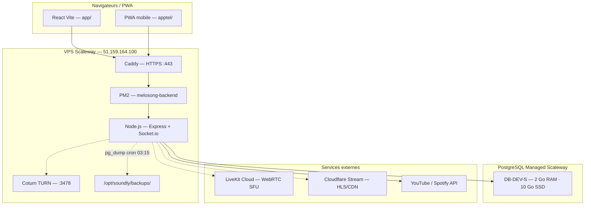

# Infra Soundy — MeloSongv2

> Document d'infrastructure : architecture, RPO/RTO, ressources, coûts et risques.  
> **Dernière mise à jour :** juin 2026 · **Production :** [getsoundy.com](https://getsoundy.com)

Pour une vue interactive riche, ouvrir le canvas Cursor :  
`~/.cursor/projects/c-Users-valen-iCloudDrive-Application-MeloSong-MeloSongv2/canvases/infra-soundy.canvas.tsx`

---

## Vue d'ensemble

| Élément | Valeur |
|---------|--------|
| VPS | `51.159.164.100` · Scaleway DEV1-S · Paris `fr-par` |
| Chemin app | `/opt/soundly` |
| PostgreSQL | `51.15.132.229:14440` · DB-DEV-S · instance `soundy-prod` |
| Utilisateurs actuels | ~10 |
| Cible scaling | 10 000 (DB-PRD-S recommandé) |

---

## Architecture



### Priorité modes live (`streamMode`)

1. **LiveKit** — caméra navigateur, quota Build gratuit (100 concurrents, 5 000 min/mois)
2. **Cloudflare Stream** — RTMP → HLS, spectateurs illimités
3. **Mesh WebRTC + Coturn** — fallback, limite ~30 spectateurs

---

## Coûts mensuels (€)

| Poste | €/mois | Détail |
|-------|--------|--------|
| VPS Scaleway DEV1-S | 8–12 (~10) | Node, Caddy, PM2, Coturn, backups locaux |
| PostgreSQL DB-DEV-S | ~15 | 1 vCPU, 2 Go RAM, 10 Go SSD |
| Domaine getsoundy.com | ~1 | Renouvellement ~10–15 €/an |
| Coturn TURN | 0 | Inclus VPS |
| Cloudflare Stream | 0 fixe | 1 $ / 1 000 min visionnées |
| LiveKit Build | 0 fixe | Ship ~46 €/mo si dépassement |
| **Total MVP** | **~24–28 €** | Hors streaming variable |

### Projection scaling

| Stade | Infra fixe | Streaming (hyp.) | Total |
|-------|------------|------------------|-------|
| MVP (~10 users) | ~26 € | 0 € | ~26 € |
| Croissance (50 lives × 200 spec.) | ~26 € | ~332 € CF | ~357 € |
| 10k users | ~75 € (DB-PRD-S) | variable | ~500+ € |

---

## RAM

| Composant | RAM | Notes |
|-----------|-----|-------|
| VPS total | ~1,9 Go | DEV1-S |
| Node.js / PM2 | ≤ 512 Mo | `max_memory_restart: 512M` |
| Caddy | ~50–100 Mo | Reverse proxy |
| Coturn | ~50–80 Mo | TURN relay |
| OS + marge | ~350 Mo + libre | Headroom recommandé |
| PostgreSQL Managed | 2 Go | Instance séparée (hors VPS) |
| PG_POOL_MAX | 10 | Connexions pool Node → PG |

> Postgres sur le même VPS que Node est **déconseillé** en production.

---

## Stockage

| Emplacement | Capacité | Contenu |
|-------------|----------|---------|
| VPS DEV1-S | ~20 Go SSD | App, logs, backups locaux |
| PostgreSQL Managed | 10 Go SSD | Données durables (users, DMs, fil…) |
| Backups VPS | ~176 Ko (6 fichiers) | Dumps `soundy-*.sql.gz` |
| Backups Scaleway | Inclus plan | Snapshots automatiques console |
| Uploads utilisateur | Variable VPS | `/opt/soundly/public/uploads/` — **backup hebdo** (`backup-uploads.sh`) |

---

## Sauvegardes — triple couche

### Couche 1 — VPS DB (`deploy/backup-db.sh`)

| Paramètre | Valeur |
|-----------|--------|
| Fréquence | Quotidien **03:15** (cron) |
| Rétention | **14 jours** (`RETENTION_DAYS=14`) |
| Sortie | `/opt/soundly/backups/soundy-YYYYMMDD-HHMMSS.sql.gz` |
| **RPO** | **≤ 24 h** (pire cas juste après backup) |
| **RTO** | **30 min – 2 h** (restore sur base test) |

### Couche 1b — VPS uploads (`deploy/backup-uploads.sh`)

| Paramètre | Valeur |
|-----------|--------|
| Fréquence | Hebdomadaire **dim. 04:30** (cron) |
| Rétention | **28 jours** |
| Sortie | `/opt/soundly/backups/uploads/uploads-YYYYMMDD-HHMMSS.tar.gz` |
| **RPO uploads** | **≤ 7 j** |

### Couche 1c — Copie off-site VPS (`deploy/backup-offsite.sh`)

| Paramètre | Valeur |
|-----------|--------|
| Fréquence | Quotidien **04:00** (après pg_dump) |
| Destination locale | `/opt/soundly/backups-offsite/` |


### Object Storage — activation manuelle (SCW_BUCKET)

Le sync S3 de `backup-offsite.sh` nécessite un bucket et des clés IAM. Sur la machine de dev, le CLI `scw` n’est pas toujours installé ; la procédure console reste la référence.

1. [Console Object Storage](https://console.scaleway.com/object-storage) → bucket **soundy-backups** en **fr-par** (privé).
2. [IAM → API keys](https://console.scaleway.com/iam/api-keys) → droits Object Storage sur le bucket.
3. VPS `/opt/soundly/.env` : `SCW_BUCKET`, `SCW_REGION=fr-par`, `SCW_ACCESS_KEY`, `SCW_SECRET_KEY` (voir `deploy/.env.production.example`).
4. VPS : `bash /opt/soundly/deploy/setup-scaleway-object-storage.sh --vps-only` (installe `awscli`, teste `backup-offsite.sh`).
5. `mkdir -p /opt/soundly/public/uploads` ; `backup-uploads.sh` archive dès qu’il y a des fichiers.

Helper : `deploy/setup-scaleway-object-storage.sh` (création bucket via `scw` si CLI configuré).

| Object Storage (opt.) | `SCW_BUCKET` + clés S3 → sync Scaleway |
| Rétention | **30 jours** (`OFFSITE_RETENTION_DAYS`) |

### Couche 2 — Scaleway Managed Database

| Paramètre | Valeur |
|-----------|--------|
| Fréquence | Automatique (console) |
| Rétention | **7 jours** typ. (plan DB-DEV-S) |
| **RPO** | **≤ 24 h** |
| **RTO** | **15 min – 1 h** (restore snapshot console) |

### Procédure restore (extrait)

```bash
# Vérifier un dump
bash /opt/soundly/deploy/verify-backup.sh

# Restore test (NE PAS sur prod sans maintenance)
gunzip -c /opt/soundly/backups/soundy-XXXX.sql.gz | psql "$DATABASE_URL"
```

---

## RTO par scénario de panne

| Scénario | RTO estimé | Mitigation |
|----------|------------|------------|
| Crash process Node | 1–2 min | PM2 autorestart |
| Health check KO | ≤ 2 min | `healthcheck.sh` cron */2 |
| Caddyfile corrompu | ≤ 5 min | `caddy-watchdog.sh` cron */5 |
| Redémarrage VPS | 5–15 min | PM2 startup + Caddy systemd |
| Perte VPS complète | 2–4 h | Nouveau VPS + restore + deploy |
| Corruption DB (dump VPS) | 1–3 h | Restore pg_dump |
| Corruption DB (Scaleway) | 15 min – 1 h | Snapshot console |
| Perte uploads | **RTO ~1 h** | Restore `backup-uploads.sh` + off-site |

---

## Environnements

| | **msdev (DEV)** | **production** |
|---|-----------------|----------------|
| URL | http://localhost:5173 | https://getsoundy.com |
| API | http://localhost:4080 | https://getsoundy.com/api |
| `APP_ENV` | `msdev` | `production` |
| Données | `msdev/data/store.json` | PostgreSQL Scaleway |
| Lancement | `npm run dev` | `deploy_zero_downtime.ps1` |
| Bots démo | Oui | Non |

---

## Risques & lacunes

| Risque | Sévérité | Statut / mitigation |
|--------|----------|---------------------|
| Uploads non sauvegardés | Élevée | **Mitigé** — `backup-uploads.sh` + cron hebdo ; doc RUNBOOK |
| Persistance PG concurrente (DELETE+INSERT) | Élevée | **Mitigé** — mutex sérialisé dans `pgStore.ts` |
| Snapshot store invalide en prod | Élevée | **Mitigé** — validation renforcée `isValidPersistedStore` + rejet avant write |
| Suppression masse comptes (DELETE FROM users) | Critique | **Corrigé** — UPSERT par utilisateur (`pgUsers.ts`), jamais de DELETE global ; refus d’écrire si store mémoire vide alors que PG contient des users |
| Pas de backup off-site | Moyenne | **Mitigé** — `backup-offsite.sh` (copie 2e chemin + S3 optionnel) |
| Autobackup Scaleway non vérifié | Moyenne | **Partiel** — `verify-scaleway-backup.sh` (checklist manuelle console) |
| Pas de snapshot VPS auto | Moyenne | **Partiel** — rappel `snapshot-vps-reminder.sh` + deploy PS1 |
| Historique chat illimité | Moyenne | **Mitigé** — purge `MAX_CHAT_MESSAGES_PER_ROOM` (déf. 500) |
| `DATABASE_URL` absent → store.json | Moyenne | `verify-prod.sh` hebdo |
| msdev/store.json + iCloud | Moyenne | Ne pas sync iCloud |
| DB-DEV-S à 10k users | Info | Migrer DB-PRD-S (~50 €/mo) |
| Mesh WebRTC ≤ 30 spec. | Info | LiveKit / Cloudflare pour scale |

---

## Scripts ops

| Script | Rôle |
|--------|------|
| `deploy/backup-db.sh` | Dump PostgreSQL → backups/ |
| `deploy/backup-uploads.sh` | Archive tar.gz uploads utilisateur |
| `deploy/backup-offsite.sh` | Copie secondaire DB + uploads (+ S3 optionnel) |
| `deploy/install-uploads-backup-cron.sh` | Cron hebdo uploads (dim. 04:30) |
| `deploy/install-offsite-backup-cron.sh` | Cron quotidien off-site (04:00) |
| `deploy/setup-scaleway-object-storage.sh` | Bucket + awscli VPS + test off-site |
| `deploy/verify-scaleway-backup.sh` | Checklist manuelle console Scaleway |
| `deploy/snapshot-vps-reminder.sh` | Rappel snapshot VPS avant upgrade |
| `deploy/verify-backup.sh` | Intégrité dump `.sql.gz` |
| `deploy/verify-prod.sh` | Checklist ops VPS (+ âge backups) |
| `deploy/install-backup-cron.sh` | Cron 03:15 |
| `deploy/ecosystem.config.cjs` | PM2 (512M, autorestart) |
| `deploy/healthcheck.sh` | Redémarre PM2 si /health KO |

---

## Références

- [`docs/COUT-APPLICATION.md`](COUT-APPLICATION.md)
- [`deploy/README.md`](../deploy/README.md)
- [`deploy/RUNBOOK-PROD.md`](../deploy/RUNBOOK-PROD.md)
- [Console Scaleway](https://console.scaleway.com)
- [Cloudflare Dashboard](https://dash.cloudflare.com)
- [LiveKit Cloud](https://cloud.livekit.io)
